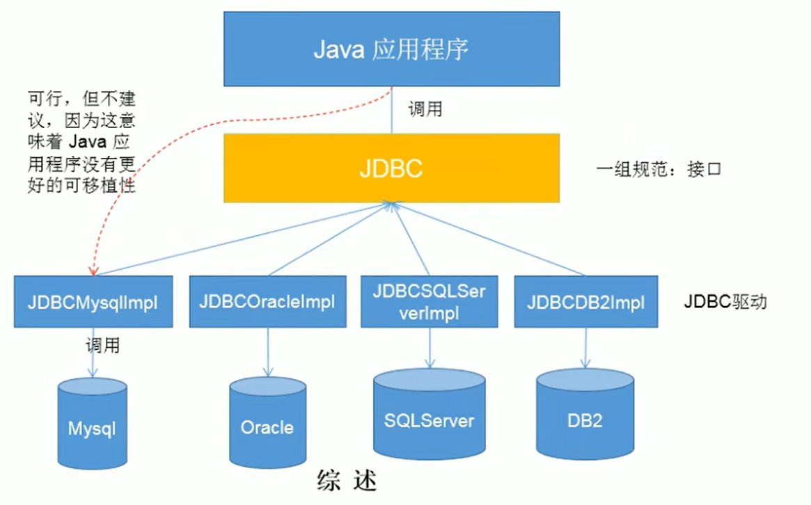
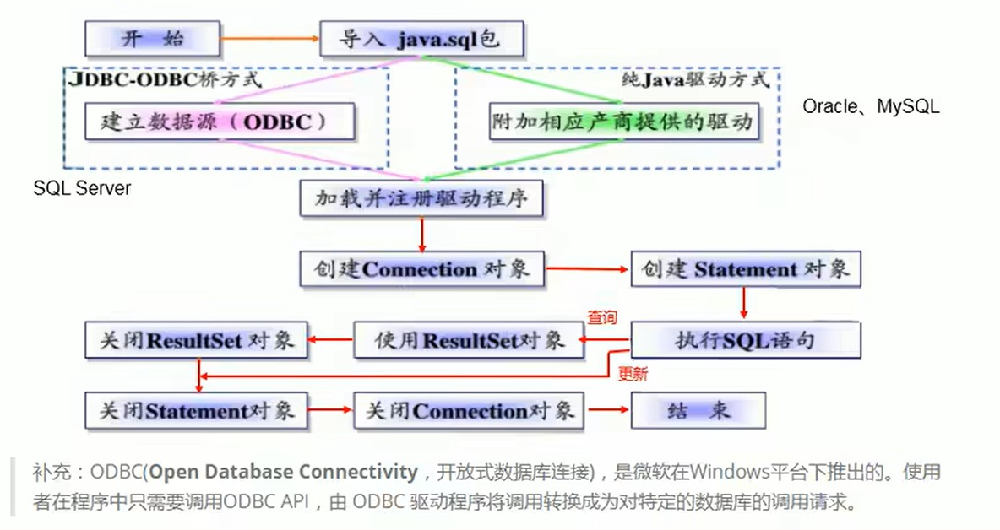
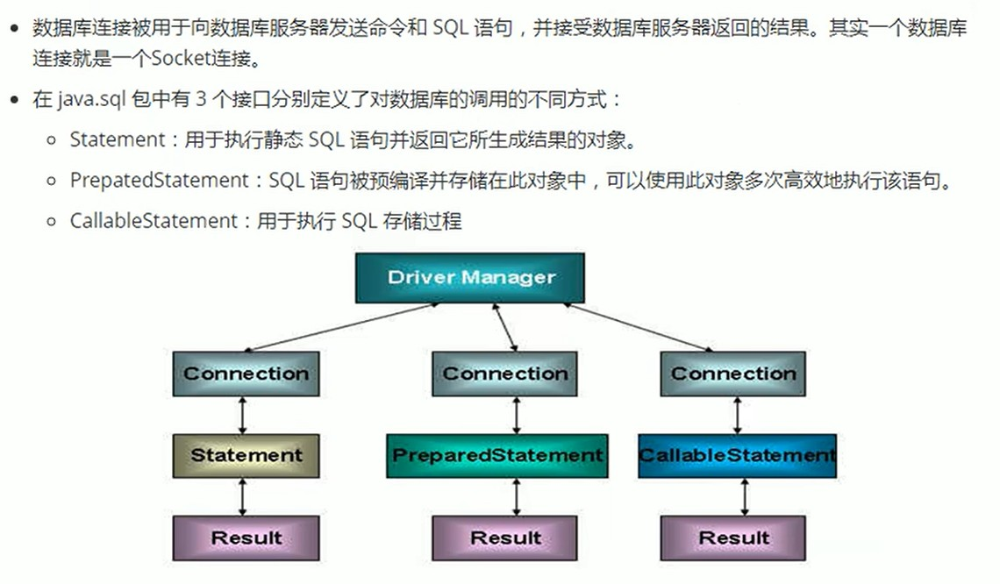
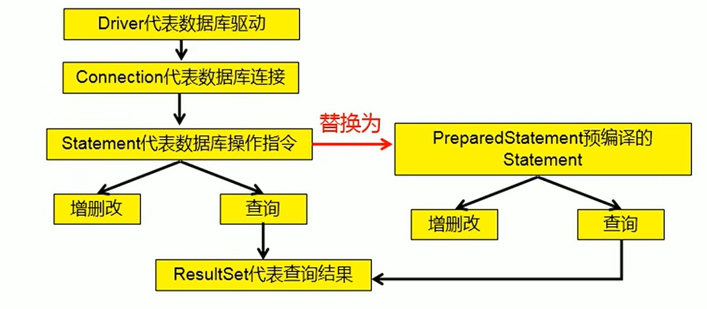
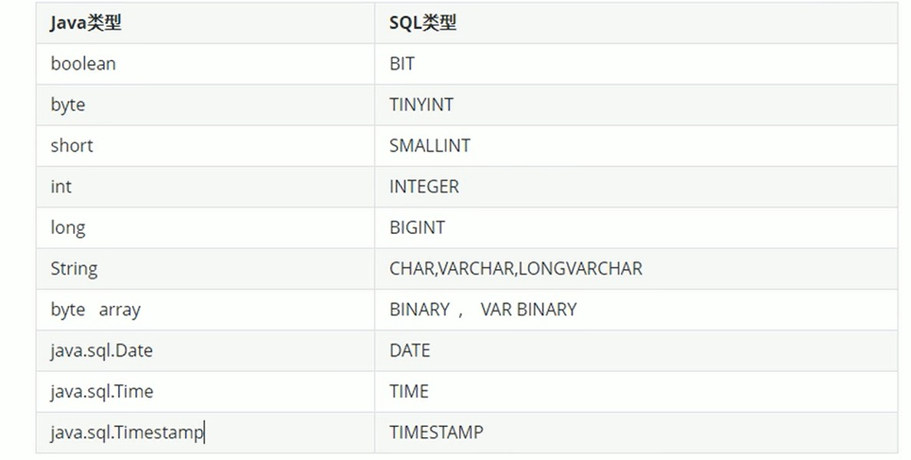
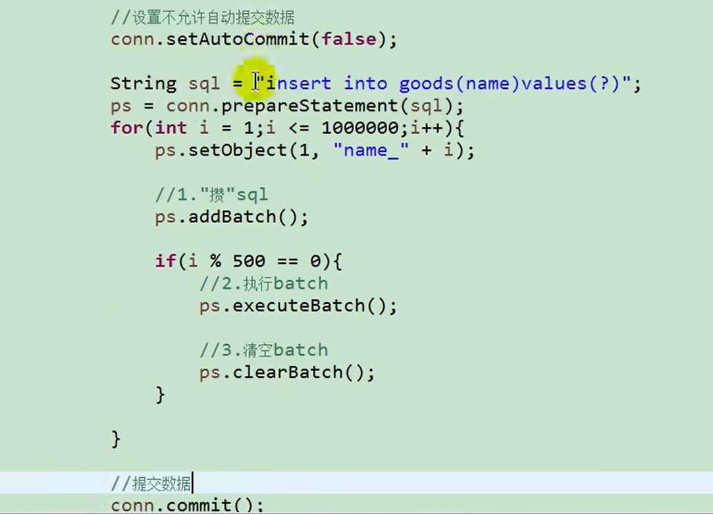
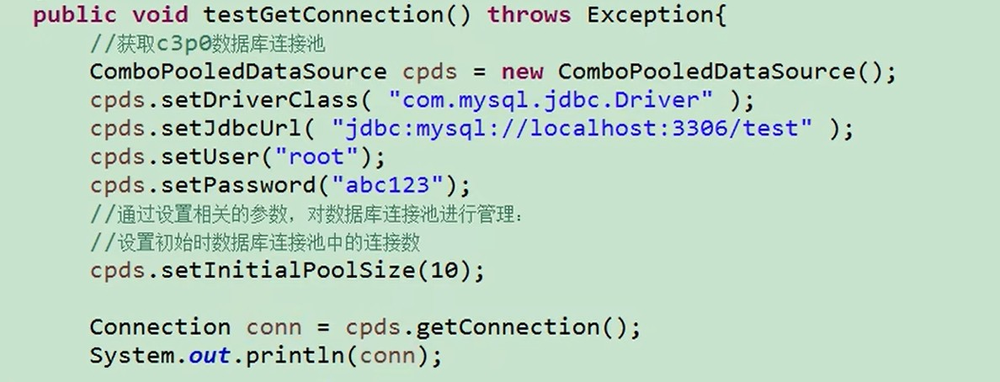

# 一、JDBC体系结构



```markdown
JDBC是SUN公司提供的针对数据库DML，DDL操作的一套接口，这套接口包含两个层次

1. 面向应用的API：SUN公司提供一套抽象接口，是java连接数据库的规范，供开发人员使用（获取连接，执行SQL，获得结果..）

2. 面向数据库的API：各个数据库厂商对SUM公司提供的接口编写的实现类，即数据库驱动。

- 开发人员只需要调用接口操作数据库即可，具体的实现已经由数据库厂商完成了
```


# 二、JDBC编写步骤




# 三、JDBC连接数据库

```
一般不直接使用Driver，而是使用DriverManager来注册Driver。
```

```java
@Test
public void m2() throws IOException, ClassNotFoundException, SQLException {
    Class.forName(driverClass);
    Connection connection = DriverManager.getConnection(url, userName, password);
    System.out.println("connection = " + connection);
}
```


# 四、JDBC操作数据库



## ①Statement

```markdown
- 弊端：需要拼接SQL，SQL的条件是用字符串进行拼接的。存在SQL注入问题。一般不用
```


## ②PreparedStatement

```markdown
1. 预编译的索引从1开始

2. 解决了SQL字符串拼接问题

3. 可以操作Blob类型的数据，意思就是占位符可以传一个文件流。而Statement做不到

4. 批量插入比Statement快，PreparedStatement只需要校验一次SQL语句，而Statment插入多少次就校验多少次


PreparedStatement预编译：编译器编译后的SQL语句会被缓存，下次调用相同的预编译语句就不需要生成SQL了，只需要调用缓存好的SQL，然后把对应的占位符填充就可以执行了。PreparedStatement的创建需要SQL语句，所以创建出来时就已经确定了SQL的逻辑，外部无法通过SQL注入的方式来改变已经确定的SQL逻辑

Statement：编译之后不会进行缓存，每次执行都要进行编译，语法检查。
```



```
ORM思想处理结果集，类型的对应关系
```




## ③操作Blob类型的数据

```
使用PreparedStatement操作Blob类型的字段。和操作普通字段一样，只不过占位符对应的参数需要传递的是一个读取了这个文件的流

```


## ④批量操作

```markdown
1. 使用PreparedStatement实现批量数据的操作。

2. 注意：MySQL默认是关闭批处理操作的，需要在URL后面添加参数来开启批处理功能

3. 批处理的核心在于，不要每填充一次占位符后执行，而是填充完占位符之后把这个SQL'攒'起来，到一定量的时候一起执行。
```



```
启用手动提交可以减少批处理IO的次数，等所有的批处理SQL全部执行后一次性的通过IO写到数据库。避免每批量处理一批数据就要IO写到数据库一次，如果批处理的次数多，那么IO的次数也就多。
```


# 五、JDBC事务控制

```markdown
1. 使用Connection设置手动提交事务时，提交完成之后一定要再设置回自动提交，类似于使用完之后恢复初始状态。尤其是在数据库连接池中。

2. Java代码可以设置数据库的隔离级别
```


# 六、数据库连接池

```markdown
1. 数据库连接池主要由JDK中的'javax.sql.DataSource'接口表示规范，一般由服务器实现。也有第三方的开源组织实现

	（1）DataSource标准来说是数据源，里面有'连接池'和'连接池管理'两个部分。但是通常习惯称呼DataSource为连接池

2. 第三方实现
	（1） DBCP：Apache提供的数据库连接池。Tomcat集成了DBCP连接池技术，相较于C3P0速度较快，但是不稳定

    （2） C3P0：一个开源组织提供的数据库连接池实现。相较于DBCP速度较慢，但是稳定。Hibernate推荐使用

    （3） Druid：阿里巴巴提供的数据库连接池。稳定且快


```


```
所有的连接池使用的套路都是一样的

1. 直接创建连接池对象，通过set方法设置连接池参数

2. 创建连接池对象，通过配置文件的形式设置连接池参数
```


## ①C3P0



```
或者是用xml配置文件的形式来设置数据库连接信息
```


## ②DBCP与Druid

```
使用方式和C3P0一样，不同的是实现类的类名不同，参数的名字不同，但是意思都是一样的。
```


# 七、DbUil工具类

```
Apache提供的，封装了JDBC对数据库的操作。直到就行，实际开发用mybaits。
```


# 难点练习

```
PreparedStatement不同表通用的写方法

PreparedStatement不同表通用的查方法：查单个，查多个 
```

